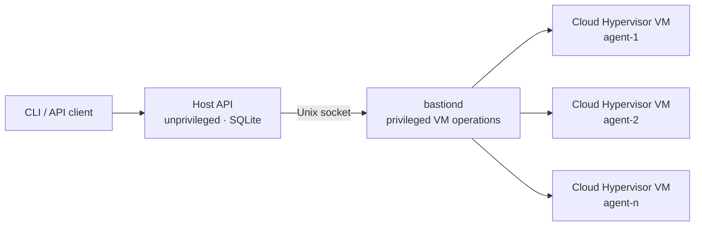

<p align="center">
  <a href="https://bastion.computer/">
    
  </a>
</p>

<p align="center"><strong>Self-hosted virtual computers for background coding agents.</strong></p>

<p align="center">
  <a href="https://github.com/bastion-computer/bastion/actions/workflows/ci.yml"></a>
  <a href="https://github.com/bastion-computer/bastion/releases/latest"></a>
  <a href="./LICENSE.md"></a>
</p>

<p align="center">
  <a href="https://bastion.computer/">Website</a> ·
  <a href="https://bastion.computer/introduction/">Docs</a> ·
  <a href="https://bastion.computer/quick-start/">Quick start</a> ·
  <a href="https://github.com/bastion-computer/bastion-demo">Demo</a> ·
  <a href="https://github.com/orgs/bastion-computer/discussions">Discussions</a>
</p>

Bastion is an open-source orchestrator for running background coding agents on your own Linux infrastructure. Each agent runs in a separate [Cloud Hypervisor](https://www.cloudhypervisor.org/) VM with a reproducible dev environment.

Define an environment in JSON, prepare it once as a snapshot, and create disposable VMs for parallel tasks. Bastion can run on a single KVM host or schedule environments across an optional multi-node cluster.

## Why Bastion?

Bastion makes it easy to scale background coding agents into reproducible environments.

- **VM-level isolation:** each environment has its own guest kernel, root filesystem, processes, and network.
- **Declarative setup:** define CPU, memory, disk, agents, service tunnels, and lifecycle actions in schema-validated JSON.
- **Prepared snapshots:** install dependencies during template creation, then replicate isolated copy-on-write environments from that prepared state.
- **Direct access:** connect through SSH, attach a local OpenCode TUI, or use `bastion mux` to move between persistent sessions.
- **Conflict-free previews:** expose dev servers on the guest VM through named tunnels for host side previews.
- **Self-hosted control:** start on one Linux machine, then add the cluster control plane when a single host is not enough.

## Quick start

### Requirements

The host needs:

- Linux on x86_64
- read/write access to `/dev/kvm`
- `/dev/vhost-vsock` for VM tunnel traffic
- nested virtualization when the host is itself a VM

### 1. Install and prepare the host

```sh
curl -fsSL https://bastion.computer/install.sh | bash

bastion system check
bastion system init --with-utilities
```

The installer adds the `bastion` CLI, guest proxy, and systemd services for the host API and privileged VM daemon. Release archives are also available from [GitHub Releases](https://github.com/bastion-computer/bastion/releases).

### 2. Create a template

```sh
cat > template.json <<'JSON'
{
  "resources": {
    "vcpu": 2,
    "memory": 2,
    "volume": 20
  },
  "agents": {
    "opencode": {}
  },
  "actions": {
    "init": [
      {
        "run": "mkdir -p /workspace && printf 'hello from Bastion\\n' > /workspace/README.md"
      }
    ]
  }
}
JSON

bastion templates create --key hello --file ./template.json
```

Template creation boots a temporary VM, runs `actions.init`, and stores an immutable prepared root disk and VM snapshot.

### 3. Launch and enter an environment

```sh
bastion env create --template-key hello --key agent-1
bastion ssh --key agent-1 -- cat /workspace/README.md
bastion ssh --key agent-1
```

With OpenCode installed locally, attach its TUI to the server inside the environment:

```sh
bastion opencode --key agent-1
```

Or open Bastion's tmux-based environment picker:

```sh
bastion mux
```

Clean up when finished:

```sh
bastion env remove --key agent-1
bastion templates remove --key hello
```

For a complete parallel-agent walkthrough, see the [Bastion issue tracker demo](https://github.com/bastion-computer/bastion-demo). It includes a Bun/TypeScript app, a reusable environment template, service previews, and five independent coding tasks.

## How it works



The local control plane is split into two processes:

1. `bastion start api` stores metadata, serves the HTTP API on `localhost:3148` by default, and runs without root privileges.
2. `bastion start daemon` performs privileged Cloud Hypervisor operations behind a Unix socket.

When a template is created, Bastion boots a temporary VM, runs the ordered `actions.init` steps, pauses it, and saves its prepared disk and VM snapshot. Creating an environment restores that snapshot, adds a small qcow2 writable overlay, runs optional `actions.start` steps, and exposes SSH, OpenCode, and configured service tunnels through the API.

For multiple hosts, the optional cluster API stores shared state in Postgres, stores prepared template archives in S3-compatible object storage, schedules environments onto registered nodes, and proxies connections to the node that owns each environment.

## A more realistic template

This example prepares a Bun project once, refreshes it whenever an environment starts, and exposes its development server:

```json
{
  "resources": {
    "vcpu": 4,
    "memory": 8,
    "volume": 40
  },
  "tunnels": {
    "web": 3000
  },
  "agents": {
    "opencode": {
      "working_directory": "/workspace/project"
    }
  },
  "actions": {
    "init": [
      {
        "use": "setup_bun"
      },
      {
        "run": "git clone https://github.com/your-org/your-repo.git project",
        "working_directory": "/workspace"
      },
      {
        "run": "bun install",
        "working_directory": "/workspace/project"
      }
    ],
    "start": [
      {
        "run": "git pull --ff-only",
        "working_directory": "/workspace/project"
      },
      {
        "run": "nohup bun run dev >/tmp/dev-server.log 2>&1 &",
        "working_directory": "/workspace/project"
      }
    ]
  }
}
```

```sh
bastion templates create --key project --file ./template.json
bastion env create --template-key project --key issue-123 --tag repo:project
bastion proxy --env-key issue-123 --name web
```

See the [template guide](https://bastion.computer/guides/templates/) and [public JSON schema](https://bastion.computer/schemas/template.json) for the complete format.

## Current limitations and security

- VM hosts currently need Linux x86_64, KVM, and vhost-vsock. macOS Apple silicon is client-only.
- `bastiond` runs as root because it manages VM lifecycle and networking operations. Template actions run as root inside the guest.
- The host API binds to `localhost:3148` by default. Anyone who can reach it can create, remove, and enter environments, so keep it private or place it behind your own authenticated network and TLS boundary.
- OpenCode is the built-in agent integration today; SSH is available for other tools and workflows.
- The project is pre-1.0, and interfaces may still change.

## Documentation

Start with the [introduction](https://bastion.computer/introduction/) and [quick start](https://bastion.computer/quick-start/), then see the guides for [system setup](https://bastion.computer/guides/system/), [templates](https://bastion.computer/guides/templates/), [environments](https://bastion.computer/guides/environments/), and [clustering](https://bastion.computer/guides/cluster/). The site also includes complete [CLI](https://bastion.computer/reference/cli/) and [API](https://bastion.computer/reference/api/) references.

## Feedback

Questions, bug reports, design feedback, and use cases are welcome in [GitHub Discussions](https://github.com/orgs/bastion-computer/discussions) or by email at [hazim@bastion.computer](mailto:hazim@bastion.computer).

## License

Bastion is available under the [MIT License](./LICENSE.md).
