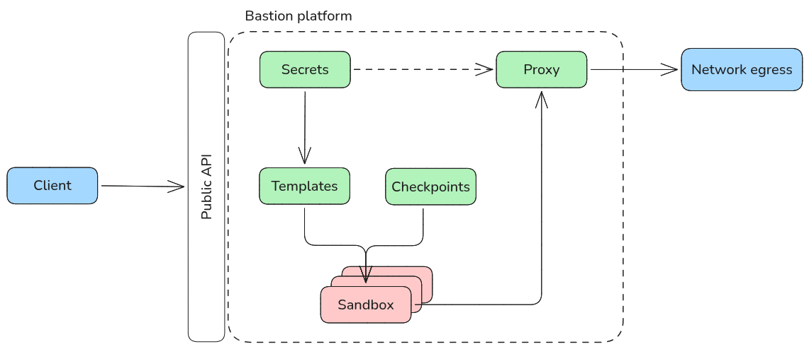

Bastion is an open source platform that makes it easy to run multiple agents on your own infrastructure.

## Architecture

At a high level, the bastion architecture is fairly simple and optimizes for an outcome where we can scale agents in a secure and reliable way.

Everything within the bounded box is operating within a single Linux machine. The green components (secrets, template, snapshot, and proxy) are on the host while the red sandboxes are isolated to virtual machines with their own guest kernel. Any interaction with bastion by downstream clients should occur via its public API.

## Sandbox

The sandbox is the core component of the bastion platform. It is a [Firecracker microVM](https://firecracker-microvm.github.io/) where agents can operate with full access to a Linux environment while securely isolated from the host.

In production, it is typical to have many sandboxes running in parallel. All other components in the system are built to support the orchestration and security challenges in managing a cluster of these sandboxes.

## Templates

Templates provide a system for configuring new sandboxes using a declarative schema. It allows developers to define the components (such as harnesses, resources, or secrets) that must be instrumented within the sandbox for their agents to operate.

## Snapshots

Sandboxes can also be started from a saved state (including memory, CPU, and disk) of another sandbox rather than from a template. This can enable use cases like branching workflows from a point in time or restoring a long running session from a previous checkpoint.

## Secrets

The secret system prevents sensitive environment variables from entering the sandbox and exposing them to exfiltration risk. Environment variables can be mapped to a reference and used in templates.

When initializing a new sandbox, the template will substitute a placeholder value that is sent into the VM rather than the actual environment variable. The sandbox will operate under the assumption that these placeholder values are the actual secrets.

## Proxy

Secret substitution alone is pointless if the actual value can't be used at some point. This is where the proxy comes in. All network calls that exit the sandbox go through a transparent proxy which handles TLS interception in order to replace the placeholder with the actual secret before sending the packet to its original destination (e.g. an external API service).

Secret references can also be configured with allow lists which are enforced at the proxy to ensure secrets are only resolved for legitimate calls.
